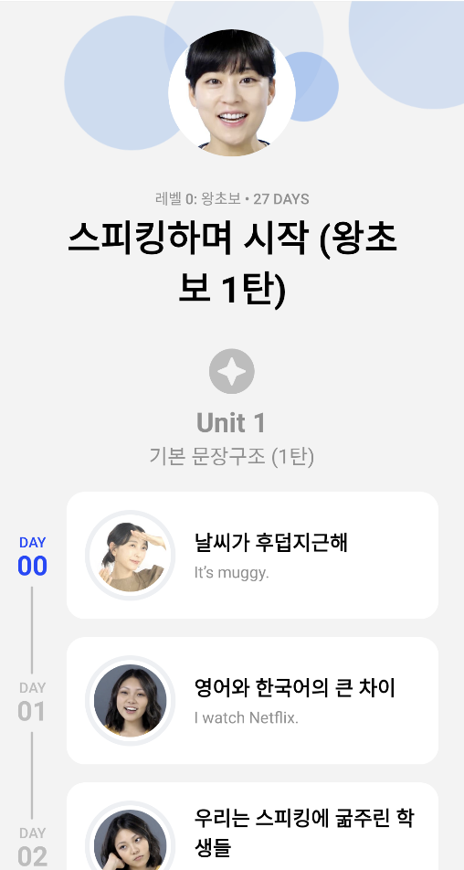
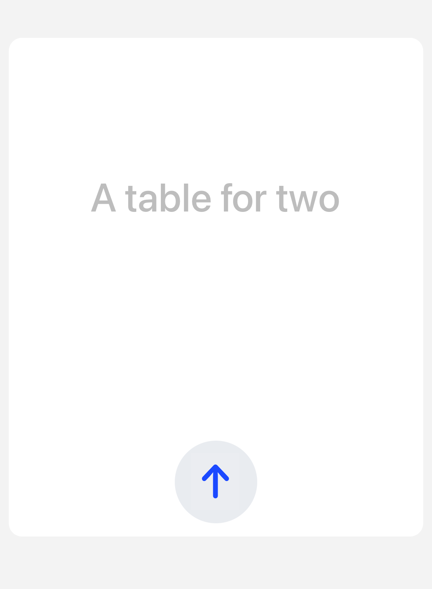

# Instructions

Please provide a working Android Studio project using git along with a README file describing the architecture.

If you are unable to complete the task within the time frame, please submit what you have completed and provide a brief explanation of what you would have done if you had more time and any caveats/compromises due to time constraints.

You can email tommy@speak.com if you need any clarification on the task.

Share the private github repo with the following github usernames:
* tc
* adhsu
* sandi
* vladimirpetrovski
* seankim-android

This project will consists of two screens:

1. Course screen that shows the course summary (course info, units, and days)

2. A simulated Speech to Text record screen that communicates with the server via a websocket connection.

Also use the [Speak app](https://play.google.com/store/apps/details?id=com.selabs.speak&hl=en_US&gl=US&pli=1) as a design inspiration but feel free to change things up.

Try making the course screen look nice. The provided JSON (`assets/course.json`) should be used as the datasource for the app.

For the UI portion, please feel free to use the UI library you are most comfortable with. We are looking for clean, well-organized code and a good architecture.

## Screens breakdown:

### 1. Course screen


Components:
- Header with course info composed of a thumbnail image, a title label and a subtitle label showing the number of days in this course
- Unit section header with a unit number label formatted as "Unit {unit number}"
- Unit day item displaying the day number, thumbnail image, day title and day subtitle

Clicking on ANY Day will take you to the Record screen.

### 2. Record screen



On this record screen, you will have a main "upload" button which will stream an audio wav data in base 64 encoding to our websocket endpoint

The response events will contain the text of the audio being uploaded.

For the sample audio, the output text should be ``This is not what we ordered``.
The text will be returned in chunks, so you will need to display the text as it comes in.
For example, the text could be be returned in the following chunks and the UI should display the text as it comes in:
- ``This is not``
- ``This is not what``
- ``This is not what we``
- ``This is not what we ordered``


#### Websocket specification:

Websocket host: `wss://speak-api--feature-mobile-websocket-interview.preview.usespeak.dev/v2/ws` 

- When connecting to the WebSocket, `x-access-token: DFKKEIO23DSAvsdf` and `x-client-info: Speak Interview Test` headers should be set.

Once the connection is established, you will *send and receive JSON strings*.

You need to send `asrStart` event to start the streaming session.

An example of `asrStart` event you can send is:
```
{
    type: "asrStart",
    learningLocale: 'en-US',
    metadata: {
        deviceAudio: {
            inputSampleRate: 16000,
        },
    },
}
```

If the websocket connection already has a streaming session connected to it, it will return `asrError` event otherwise it will return `asrMetadata` event. See below for the example JSON.

```
{
    type: "asrMetadata",
    id: "stringId",
    recordingId: "stringId",
}
```

Once the session is initiated(after the `asrMetadata` event), we can start streaming data using the following event:

```
{
	type: "asrStream",
	chunk: "XXXX", // base64 encoding of the WAV data
	isFinal: false
}
```
*NOTE: This stream data is already provided for you in `assets/asr-stream-audio-chunks.json`*

When sending the last chunk, `isFinal` flag should be set to true. This will end the asr streaming session and new one can be started after that.

While streaming, the API will be sending ASR result events with following structure:
```
{
	id: "",
	type: "asrResult",
	text: "text from audio"
	isFinal: false
}
```
Display the latest ``text`` attribute in large characters in the record screen as each event is received.

## Included assets
- icons that you could use for the UI
- JSON that serves as the app data source (`assets/course.json`)
- audio stream encoded in base64 represented as a JSON array (`assets/asr-stream-audio-chunks.json`)

## Judging Criteria

You will be evaluated based on:
* Architecture
* Code readability and a descriptive README file
* Visual implementation
* Edge case handling
* Testability: write at least one class in a testable way and include a test
* Code organization (folder structure, separation of concerns, etc.)
* Git workflow (meaningful commit messages)
* Usage of modern Android development practices and technologies
